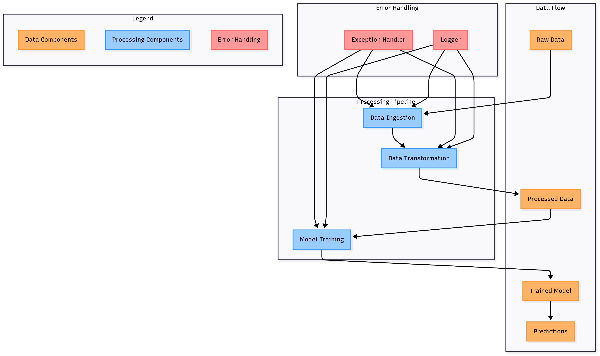

# 💎 Diamond (Gemstone) Price Prediction

This project aims to accurately predict the price of gemstones (diamonds) using machine learning techniques. It follows a **modular, production-grade ML pipeline** structure, including best practices like logging, exception handling, and environment management using `conda`. The goal is to build a clean, scalable, and deployable price prediction system.

---

## 📂 Project Structure

```
Diamond-Price-Prediction/
│
├── notebooks/              # Jupyter Notebooks for EDA and experimentation
│   ├── data/
│   │   └── gemstone.csv    # Dataset used for prediction
│   ├── EDA.ipynb           # Exploratory Data Analysis
│   └── Model Training.ipynb# Model building in notebook
│
├── src/                    # Source code package
│   ├── components/         # Core ML components
│   │   ├── data_ingestion.py
│   │   ├── data_transformation.py
│   │   └── model_trainer.py
│   ├── pipelines/          # Training & prediction pipelines
│   ├── exception.py        # Custom exception handling
│   ├── logger.py           # Logging
│   └── utils.py            # Utility functions
│
├── templates/              # HTML templates (optional for frontend)
├── app.py                  # Entry point for running the app (Flask/FastAPI)
├── requirements.txt        # Python dependencies
├── setup.py                # Installation script for the project
├── Readme.md               # Project documentation
└── .gitignore              # Ignored files in version control
```

---

## ✅ Features

* 🔍 **End-to-End ML pipeline**: Covers data ingestion, transformation, model training, and prediction.
* 🔒 **Robust Exception Handling**: Clean error tracking using custom exception classes.
* 🧾 **Detailed Logging**: Easily track the model flow and issues using logs.
* 🔧 **Modular Codebase**: All ML components are separated into modules for reusability and maintainability.
* 🧪 **Jupyter Notebook Support**: For data exploration and experimentation.
* 📦 **Production-ready Packaging**: Easily deploy or distribute the project via `setup.py`.
* 📁 **Conda Environment Support**: Isolated, reproducible environment setup.
* 🔬 **Pipeline Integration**: Training and prediction steps are structured in automated pipelines.

---

**
---

## 🧠 Model Training Workflow

* 📥 **Data Loading**: Loaded the `gemstone.csv` dataset using `pandas`.
* 🧹 **Data Cleaning**: Dropped unnecessary columns (e.g., `id`) to prepare the dataset.
* 🔄 **Preprocessing**: Applied data transformation (likely includes encoding, scaling — further confirmed in next cells).
* ✂️ **Feature Engineering**: Selected relevant features for modeling.
* 🧪 **Train-Test Split**: Divided data into training and testing sets to evaluate model generalization.
* 📈 **Model Building**: Trained regression models (such as Linear Regression, Random Forest, or others).
* ✅ **Model Evaluation**: Evaluated model performance using metrics like R² Score, MAE, or RMSE.
* 💾 **Model Persistence**: Saved the trained model for future inference or deployment using `pickle` or `joblib`.

---
**

## 🧩 Workflow Diagram

> Flow of your SoulCare system:



## 🚀 How to Use

### 1. Clone the Repository

```bash
git clone https://github.com/your-username/Diamond-Price-Prediction.git
cd Diamond-Price-Prediction
```

### 2. Setup Environment

**With Conda:**

```bash
conda create -n gemstone_env python=3.9 -y
conda activate gemstone_env
pip install -r requirements.txt
```

### 3. Prepare Data

Ensure your dataset (`gemstone.csv`) is placed inside `notebooks/data/`.

### 4. Run Notebooks

To explore the data and initial experiments:

```bash
jupyter notebook
# Open EDA.ipynb or Model Training.ipynb
```

### 5. Run Training Pipeline

```bash
python src/pipelines/training_pipeline.py
```

### 6. Start Prediction / App Interface

```bash
python app.py
```

---

## 🔮 Future Scope

* ✅ Integrate a frontend UI using Flask/Streamlit for user interaction.
* 🗃 Add model versioning using MLflow or DVC.
* 🧠 Experiment with advanced models (XGBoost, CatBoost).
* 📊 Add evaluation dashboard using Streamlit or Dash.
* ☁ Deploy on cloud (AWS/GCP/Azure) with Docker & CI/CD.
* 🔍 Add hyperparameter tuning using Optuna or GridSearchCV.
* 📱 Develop a mobile-friendly interface or API.

---

## 🔍 Requirements

Install all the packages using:

```bash
pip install -r requirements.txt
```

Common dependencies:

* numpy
* pandas
* scikit-learn
* matplotlib
* seaborn
* jupyter
* Flask (or FastAPI)

---

## ✍️ Author

**Mahesh Singh**
AI & Data Science Enthusiast
[LinkedIn](https://www.linkedin.com/) | [GitHub](https://github.com/)

---

## 📜 License

This project is licensed under the MIT License. 
